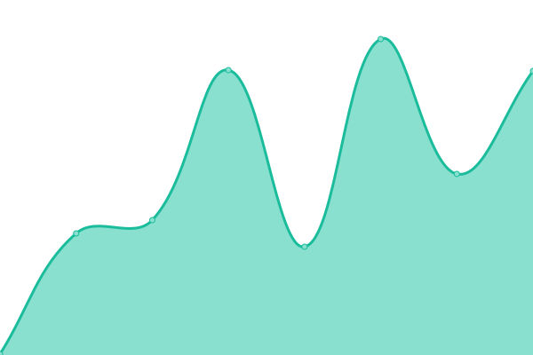

# [📈 Live Status](https://upptime.github.io/upptime): <!--live status--> **🟩 All systems operational**

This repository contains the open-source uptime monitor and status page for [Upptime](https://upptime.js.org), powered by [Upptime](https://github.com/upptime/upptime).

With [Upptime](https://upptime.js.org), you can get your own unlimited and free uptime monitor and status page, powered entirely by a GitHub repository. We use [Issues](https://github.com/upptime/upptime/issues) as incident reports, [Actions](https://github.com/elfsquad/upptime/actions) as uptime monitors, and [Pages](https://upptime.github.io/upptime) for the status page.

<!--start: status pages-->
<!-- This summary is generated by Upptime (https://github.com/upptime/upptime) -->
<!-- Do not edit this manually, your changes will be overwritten -->
<!-- prettier-ignore -->
| URL | Status | History | Response Time | Uptime |
| --- | ------ | ------- | ------------- | ------ |
|  [Elfsquad homepage](https://www.elfsquad.io/) | 🟩 Up | [elfsquad-homepage.yml](https://github.com/Elfsquad/upptime/commits/HEAD/history/elfsquad-homepage.yml) | 

 275ms
     
 | 

<a href="https://elfsquad.github.io/upptime/history/elfsquad-homepage">100.00%</a>
    

|  [EMS](https://ems.elfsquad.io/) | 🟩 Up | [ems.yml](https://github.com/Elfsquad/upptime/commits/HEAD/history/ems.yml) | 

 373ms
     
 | 

<a href="https://elfsquad.github.io/upptime/history/ems">100.00%</a>
    

|  [Data API](https://api.elfsquad.io/data/1/health/ready) | 🟩 Up | [data-api.yml](https://github.com/Elfsquad/upptime/commits/HEAD/history/data-api.yml) | 

 516ms
     
 | 

<a href="https://elfsquad.github.io/upptime/history/data-api">100.00%</a>
    

|  [Configurator API](https://api.elfsquad.io/configurator/1/health/ready) | 🟩 Up | [configurator-api.yml](https://github.com/Elfsquad/upptime/commits/HEAD/history/configurator-api.yml) | 

 131ms
     
 | 

<a href="https://elfsquad.github.io/upptime/history/configurator-api">100.00%</a>
    

|  [Quotation API](https://api.elfsquad.io/quotation/1/health/ready) | 🟩 Up | [quotation-api.yml](https://github.com/Elfsquad/upptime/commits/HEAD/history/quotation-api.yml) | 

 179ms
     
 | 

<a href="https://elfsquad.github.io/upptime/history/quotation-api">100.00%</a>
    

|  [Core API](https://api.elfsquad.io/api/2/health/ready) | 🟩 Up | [core-api.yml](https://github.com/Elfsquad/upptime/commits/HEAD/history/core-api.yml) | 

 133ms
     
 | 

<a href="https://elfsquad.github.io/upptime/history/core-api">100.00%</a>
    

<!--end: status pages-->

[**Visit our status website →**](https://upptime.github.io/upptime)

## 📄 License

- Powered by: [Upptime](https://github.com/upptime/upptime)
- Code: [MIT](./LICENSE) © [Anand Chowdhary](https://anandchowdhary.com), supported by [Pabio](https://pabio.com)
- Data in the `./history` directory: [Open Database License](https://opendatacommons.org/licenses/odbl/1-0/)
